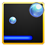
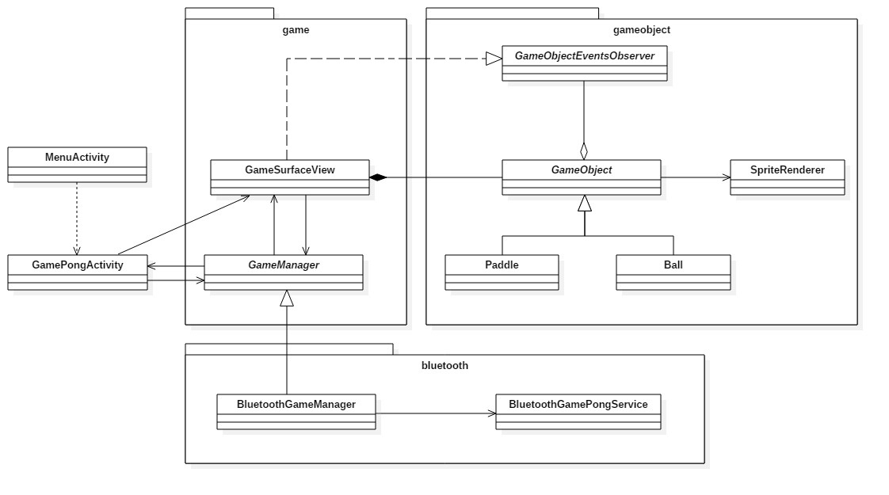
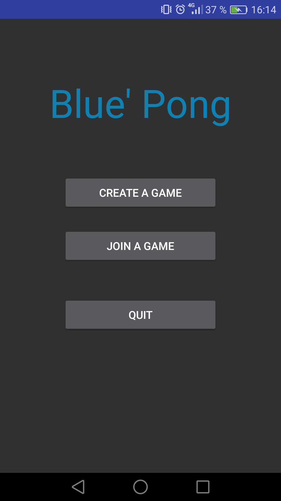
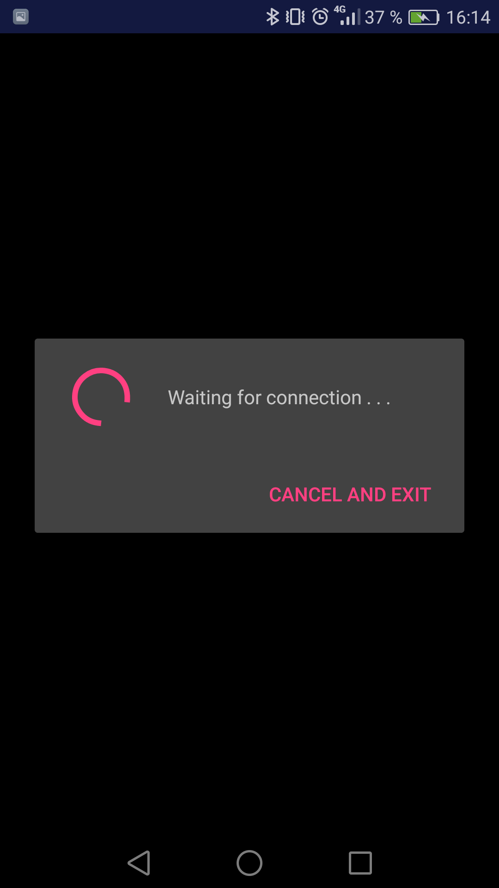
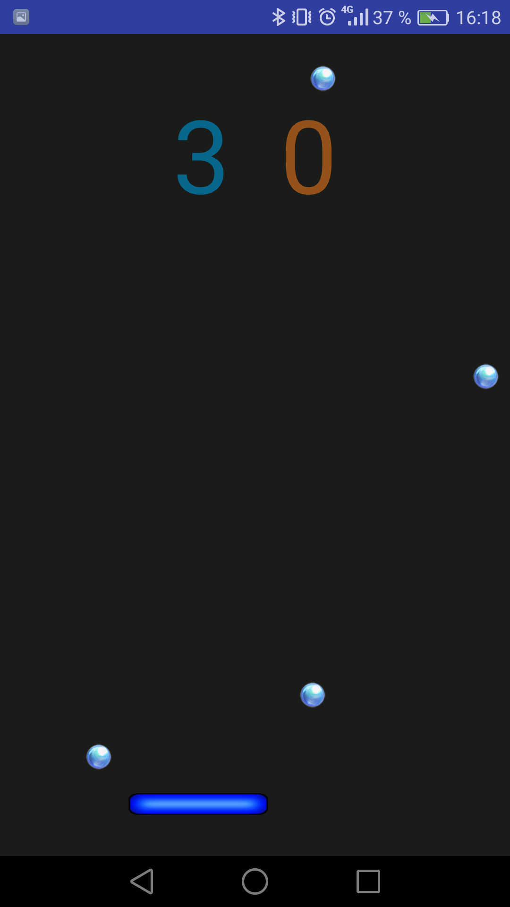

# Blue' Pong

Le jeu de Pong est un vieux jeu d'arcade très simpliste qui se joue à deux. Les joueurs ont chacun un paddle, une barre sur laquelle ils peuvent faire rebondir une balle qu'ils doivent renvoyer dans le terrain adverse. Quand un des joueurs laisse passer la balle, le joueur adverse gagne un point et une nouvelle balle est mise en jeu. Si un des joueurs atteint le nombre de points maximum, il gagne la partie.

Cette application reprend le principe du jeu de Pong, mais en permettant aux deux joueurs de jouer chacun sur leur appareil mobile. Chaque joueur voit donc uniquement la moitié du terrain et la balle passe d’un écran à l’autre. Le paddle se déplace de droite à gauche en fonction de l’orientation du téléphone.
Pour rendre le jeu plus intéressant une balle est ajoutée sur chaque terrain avec une direction aléatoire toutes les 7 secondes de jeu.

-----------

### Utilisation de l'application

Au lancement de l'application le joueur se trouve face à un menu lui proposant de créer une partie, de rejoindre une partie créée ou de quitter l'application. Pour que deux joueurs puissent jouer ensemble, un des joueurs doit créer une partie et le second doit rejoindre la partie créée en sélectionnant le nom de l'appareil qui a créé la partie dans la liste des périphériques Bluetooth proposés.
Une fois les deux appareils connectés, le jeu est automatiquement lancé. A partir du moment ou l’un des joueurs a atteint un score de 10, la connexion Bluetooth est arrêtée et un message de gain ou de perte est affiché à chaque utilisateur.

### Modélisation simplifiée de l'application

### Captures d'écran

